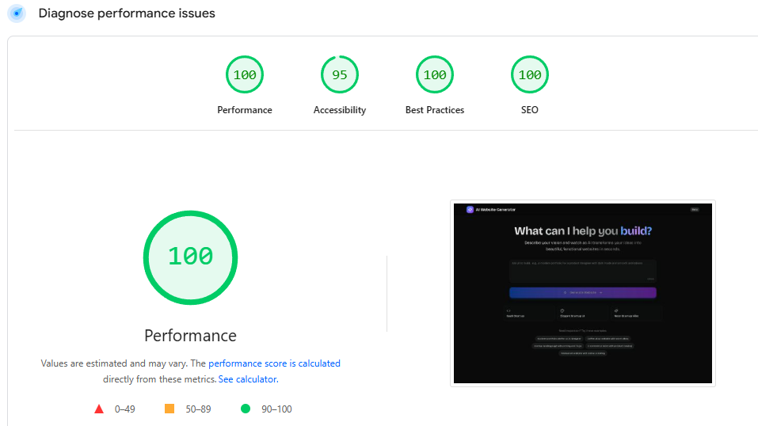

# 🔮 AI Website Generator

A modern MVP that uses AI to generate full multi-page websites from natural language prompts. Users can describe the kind of website they want and instantly get a live preview with editable content and theme customization.

---

## 🚀 Live Demo

🌐 [Click Here →](https://webgn-ai.vercel.app)

---

## 🧭 Architecture


---

## ⚡ Performance

This app is optimized for speed and accessibility.




## ✨ Features

- 🧠 AI-powered multi-page website generation from plain-text descriptions  
- 🎨 Live visual preview with editable content in a real iframe  
- 🎯 Theme customization: button color and text color  
- 📄 Page-based CMS-style navigation in sidebar  
- 🔁 Regenerate the site from a new prompt at any time  
- 🧭 Mobile warning for best desktop experience  
- ⚡ Built with modern, clean UI and fluid transitions

---

## 🧱 Tech Stack

| Layer        | Stack                                                                 |
|--------------|-----------------------------------------------------------------------|
| Frontend     | Next.js 15 App Router, TypeScript, Shadcn UI, Tailwind CSS            |
| State Mgmt   | Zustand for UI and generated content state                            |
| Backend      | Node.js(TS) + Gemini 1.5 Flash API for HTML/CSS generation      |                                                                |
| Styling      | Tailwind CSS, Lucide Icons                                            |
| Deployment   | Vercel                                                                |                          |

---

## 🤝 Contributing

1. **Fork the repo**

2. **Clone your fork:**

   ```bash
   git clone https://github.com/yourname/ai-website-generator
   ```

3. **Install dependencies:**
 
 ```bash 
 npm install
 ```

4. **Set up your .env file:**

```bash
OPENAI_API_KEY=...
```
5. **Run the app locally:**
```bash
npm dev
```

